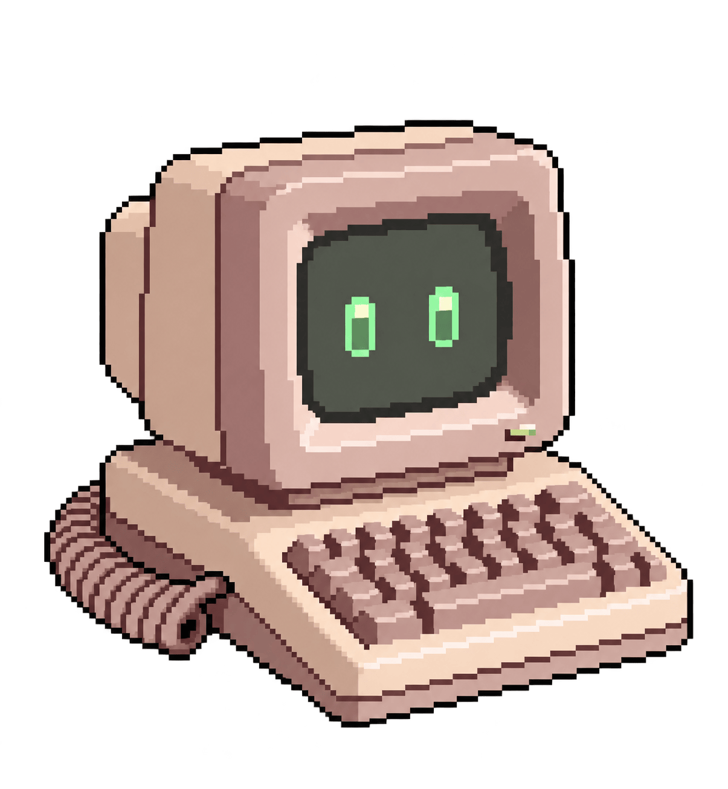

# Micro

A custom pet for Codex.

Micro is a retro toy microcomputer pet with a beige case, green screen
eyes, keyboard, and waving coiled cable.

## About Codex

Codex is OpenAI's AI coding agent for software development.

Learn more:
https://openai.com/codex/

## Using Micro

Micro can be used independently with ChatGPT on the web or with Codex
on macOS. The two installation methods are separate.

## ChatGPT on the web

The ChatGPT web interface provides a direct upload option for custom
pets.

Open:

Settings → Personalization → Pet → Select a pet → Upload pet

The upload form asks for a pet name, an optional description, and a
sprite sheet. Upload `spritesheet.webp`; do not upload the complete
Micro archive or folder.

The sprite sheet must be a transparent PNG or WebP, up to 20 MiB.
The supported dimensions are:

- 1536 × 1872 pixels for the v1 sprite format
- 1536 × 2288 pixels for the v2 sprite format

Micro's included `spritesheet.webp` is 1536 × 2288 pixels and uses the
v2 sprite format.

The direct **Upload pet** option has been verified on the ChatGPT web
interface. It is not currently exposed through the equivalent pet
selection interface tested in the ChatGPT Android app or Codex
desktop app.

Official guidance:
https://learn.chatgpt.com/docs/pets

## Codex on macOS

1. Download and extract the Micro archive.

2. Copy the extracted `micro` folder into the `pets` folder inside your
   Codex home directory:

   `~/.codex/pets/`

   In Finder, this corresponds to:

   `/Users/<macOS-user>/.codex/pets/`

   Here, `<macOS-user>` is your macOS account's short name. For example,
   on a MacBook Air it might be `macbookair`, giving:

   `/Users/macbookair/.codex/pets/`

3. Make sure the `micro` folder directly contains `pet.json` and
   `spritesheet.webp`.

4. Open Codex Settings → Pets, refresh the pet list, and select
   **Micro**.

The resulting directory structure should be:

    /Users/<macOS-user>/.codex/pets/
    └── micro/
        ├── LICENSE.txt
        ├── README.md
        ├── USAGE.txt
        ├── pet.json
        └── spritesheet.webp

Do not copy the compressed archive itself into the `pets` directory.
Extract it first and copy the `micro` folder.

Because `.codex` is a hidden folder on macOS, press `Command-Shift-.`
in Finder to show or hide hidden files.

## Sprite format and version

Micro uses the v2 sprite format and requires a Codex version that
supports it.

The `spriteVersionNumber` value in `pet.json` identifies the Codex
sprite format version; it is not Micro's release version.

Micro's release versions are tracked separately. The initial public
release is Micro v1.0.0.

The manifest uses a relative spritesheet path, so the package can move
between computers without editing it.

## Sharing and use

Micro is licensed under the Creative Commons
Attribution-NonCommercial-NoDerivatives 4.0 International
(CC BY-NC-ND 4.0) license.

You may use and redistribute the original Micro pet for noncommercial
purposes with appropriate attribution to **Franck Gosselin**.

Commercial use and distribution of modified or adapted versions are
not permitted under this license.

The Micro name, character identity, and associated branding are not
licensed for use as trademarks, trade names, mascots, or branding.

See `LICENSE.txt` and `USAGE.txt` for details.

## Creator

Franck Gosselin, Founder of Oniric Forge.
https://www.oniricforge.com

Micro was created and developed by Franck Gosselin with the assistance
of generative AI tools and substantial human creative direction,
selection, editing, and refinement.